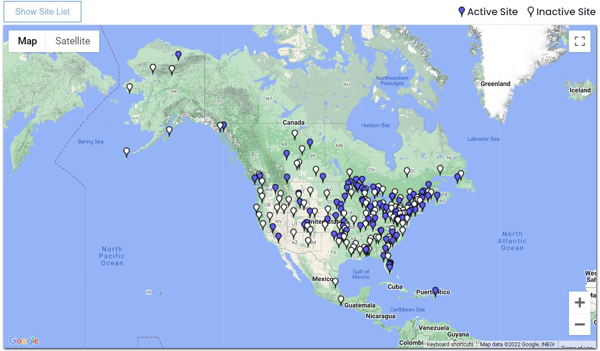

# Research computing: final project

### Introduction

Beginning in 2007, the U.S. Geological Survey (USGS) collected soil samples from 4857 sites across the conterminous United States (CONUS) and analyzed them for 45 elements, including mercury. The Mercury Deposition Network (MDN) is the only network providing a longterm record of total mercury (Hg) concentration and deposition in precipitation in the United States and Canada. Site operators collect samples every Tuesday morning. Prior to May 2022, a subset of MDN sites were also analyzed for methyl mercury. The HAL reviews field and laboratory data for completeness and accuracy, and flags samples that were mishandled, compromised by precipitation collector failures, or grossly contaminated. The HAL delivers all data and information to the NADP Program Office for final checks and resolution of remaining discrepancies. Data then are made available on the NADP website

### Scientific question/Hypothesis

 The total mercury content in soils of the United States correlates with the mercury deposition from the atmosphere. However, mercury distributions vary with depth and land cover. 

### Analysis plan

- Load the data as a Xarray or Dataframe (pandas) and merge to account for spatial variability.
- Make contour/ color mesh maps showing 1. the Total Mercury (THg) content in soils, 2. Total Mercury (THg) content in wet deposition, 3. Land cover from the soil survey.
- Make bar plots to aggregate THg content in soil and land cover.
- Make scatter plots to correlate THg content in soil and wet deposition. 
- Perform Principal Component Analysis to explore further correlations with other elements and land cover categories. 

### Data resources

1. Geochemical and Mineralogical Data for Soils of the Conterminous United States
Source: 	[USGS](https://pubs.usgs.gov/ds/801/)

2. Mercury Deposition Network
Source: [National Atmospheric Deposition Program](https://nadp.slh.wisc.edu/networks/mercury-deposition-network/)

### Binder

