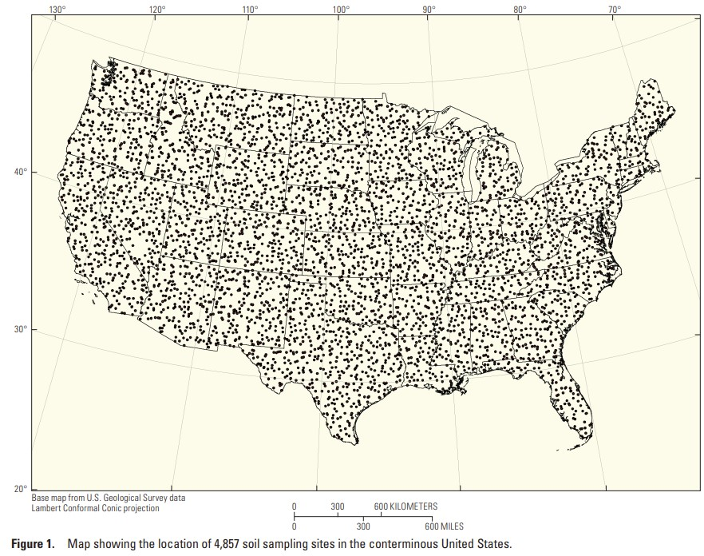

# Research computing: final project, Fall 2022

Jennifer Angel-Amaya (ja3556)

j.angel@columbia.edu

Research Computing for the Earth Sciences, Columbia University

## Description

## Mercury in soils and wet deposition in the United States

Hg is a toxic elements that cycles into the environment in many forms and has diferent sources and sinks. In this notebook, I will explore the content of Hg in wet deposition and soils across the US.  Two goals lead my investigation: (1) Describe the distribution and trend of wet deposition from 1996 to 2021, and (2) describe the relationship between Hg content and land cover and estimate non-parental mercury or due to other sources than bedrock weathering (parental mercury).

Beginning in 2007, the U.S. Geological Survey (USGS) collected soil samples from 4857 sites across the conterminous United States (CONUS) and analyzed them for 45 elements, including mercury. The Mercury Deposition Network (MDN) is the only network providing a longterm record of total mercury (Hg) concentration and deposition in precipitation in the United States and Canada. 

### Analysis plan

- Load the data as a Xarray or Dataframe (pandas) and merge to account for spatial variability.
- Make scatter plots showing 1. the Total Mercury (THg) content in soils, 2. Total Mercury (THg) content in wet deposition, 3. Land cover from the soil survey.
- Make bar plots to aggregate THg content in soil and land cover.

### Data resources

1. Geochemical and Mineralogical Data for Soils of the Conterminous United States
Source: 	[USGS](https://pubs.usgs.gov/ds/801/)

2. Mercury Deposition Network
Source: [National Atmospheric Deposition Program](https://nadp.slh.wisc.edu/networks/mercury-deposition-network/)

### Binder

